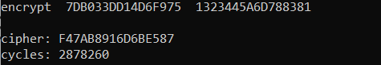
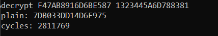

# DES

  
  

# Introduction
The Data Encryption Standard (DES) is a symmetric-key block cipher published by the National Institute of Standards and Technology (NIST).  DES is an implementation of a Feistel Cipher. It uses 16 round Feistel structure. The block size is 64-bit. Though, key length is 64-bit, DES has an effective key length of 56 bits, since 8 of the 64 bits of the key are not used by the encryption algorithm (function as check bits only).

# DES Structure

  

# How to run
for encryption

    1701636.exe encrypt plain_text key

for decryption

    1701636.exe decrypt cipher_text key
    
# Examples

  
   
  

